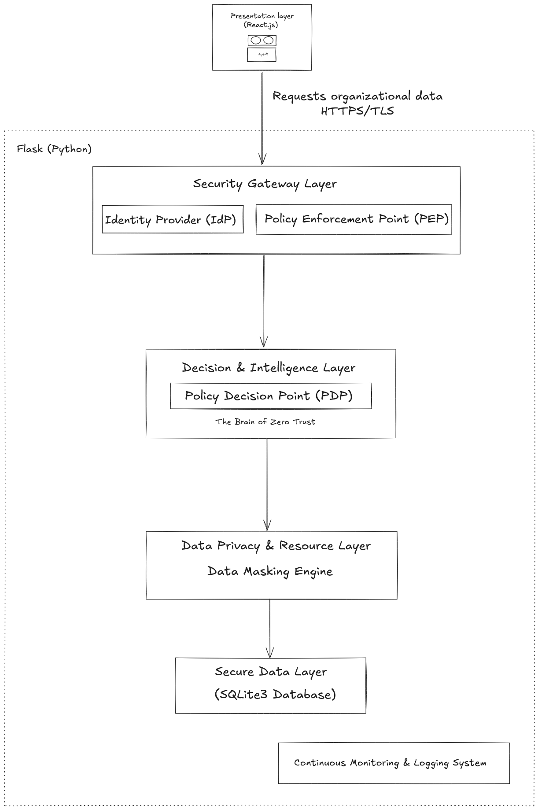
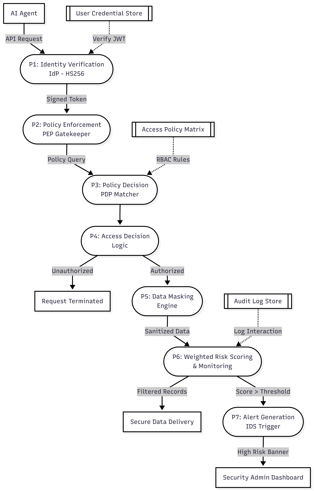
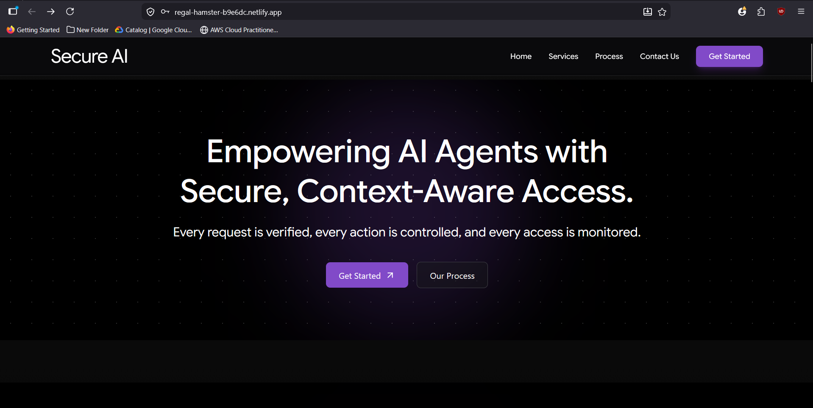
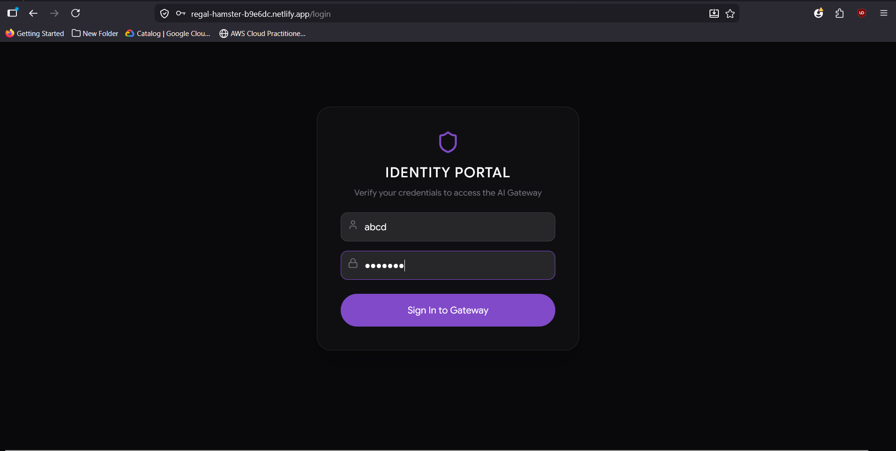
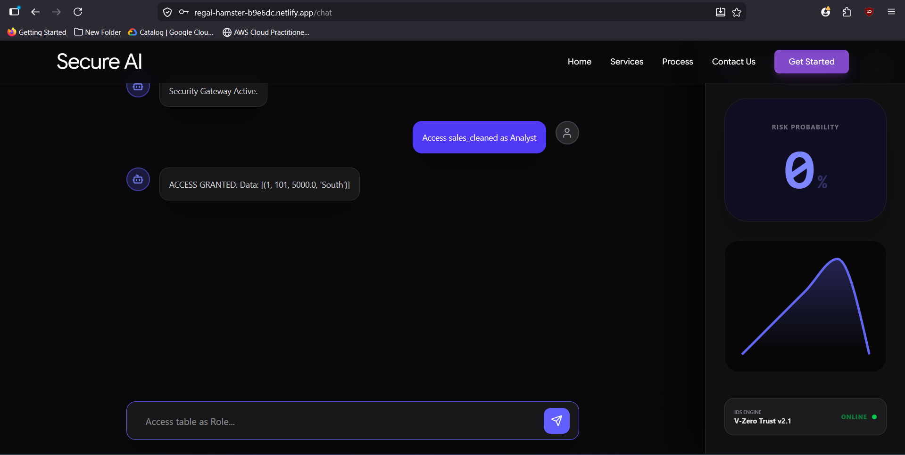
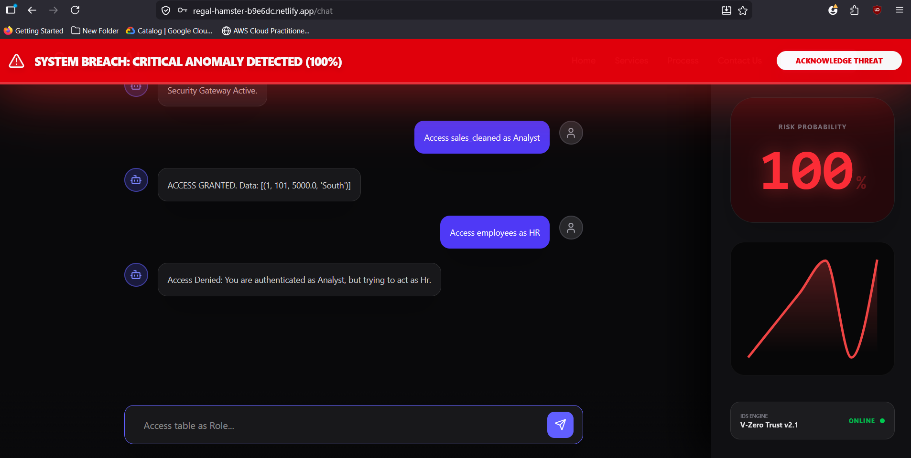

# Zero Trust Arhitecture for AI Agents

## Problem Statement

In the current landscape of enterprise AI, most systems rely on static authentication. Once an AI agent or a user logs in, they are granted broad, persistent access to organizational data. This creates three critical vulnerabilities:

**1. Over-privileged Agents:** AI agents are often granted access to entire databases, increasing the "blast radius" if the agent is compromised.

**2. Lack of Contextual Security:** Standard systems cannot distinguish between a legitimate request and an malicious "Prompt Injection" or unauthorized data scraping attempt.

**3. Data Exposure:** Sensitive business data (like employee salaries or revenue metrics) is often exposed in full, even when only a subset is required for the task.

## The Solution
Secure AI addresses these risks by implementing a Zero Trust Gateway modeled after the NIST 800-207 standards. Instead of assuming trust, the system treats every individual data request as a potential threat.

**1. Continuous Authorization:** By decoupling security logic (PEP/PDP) from the business data, the gateway validates the agent's identity and permissions for every single query, rather than just at login.

**2. Granular RBAC:** Access is strictly enforced at the database table level. For example, an HR user is restricted to the employees table, and any attempt to access sales_cleaned triggers a security alert.

**3. Dynamic Data Masking:** The system serves as a protective buffer, sanitizing and masking sensitive information in real-time, ensuring the AI agent only "sees" the data it is strictly authorized to process.
**4. Behavioral Monitoring:** A built-in Intrusion Detection System (IDS) calculates risk scores, enabling proactive mitigation of suspicious query patterns.

A Zero Trust security middleware that prevents AI agents from accessing unauthorized organizational data. By implementing Continuous Authentication and Role-Based Access 
Control (RBAC), this gateway ensures that every request is verified, authorized, and sanitized before data is returned.

## 🚀 Live Demo

The backend is currently deployed on Render.
### Note: The backend is on a free tier, so there may be a 30-60 second "cold start" delay upon first load.

Demo Credentials

You can use the following credentials to test the different access levels: 

| Username   | Password | Role    | Tables Allowed to Access |
|------------|----------|---------|--------------------------|
| abcd       | pass123  | Analyst | sales_cleaned            |
| hr_manager | hrpass   | HR      | employees                |
| admin_user | admin123 | Admin   | All Tables               |
|            |          |         |                          |

## System Architecture 

**1. Identity Provider (IdP)**
    *Role:* Authentication.
    *Function:* This is the entry point. It verifies the identity of the AI Agent or user attempting to connect.
    *How it works:* It checks the credentials (or JWT token) against the users database. It establishes the "Identity Context"—basically saying, "I know who this agent is, and I have assigned them a specific role (e.g., Analyst, HR)."

**2. Policy Enforcement Point (PEP)**
     *Role:* Interception & Enforcement.
     *Function:* Acting as your Flask middleware, the PEP sits right at the front of the pipeline. It intercepts every incoming HTTP request.
     *How it works:* It does not make decisions; it only enforces them. It pauses the request and asks the PDP, "Is this allowed?" If the PDP says "No," the PEP drops the connection immediately. It ensures no data ever reaches the DB without a "thumbs up" from the logic layer.

**3. Policy Decision Point (PDP)**
     *Role:* Authorization & Logic.
     *Function:* This is where your business rules reside. It compares the Agent's identity (from IdP) against the requested data resource.
     *How it works:* It evaluates the RBAC (Role-Based Access Control) Matrix. It checks: Does this role (e.g., HR) have permission to view this table (e.g., employees)? It is the final "Yes/No" decision-maker.

**4. Risk Engine & Behavioral Monitoring**
     *Role:* Anomaly Detection (IDS).
     *Function:* This sits alongside the data flow. It calculates the Weighted Risk Score for every agent.
     *How it works:* Every time an agent makes a request, the monitoring system updates its risk profile. If an agent hits a specific threshold (e.g., three unauthorized attempts), this module triggers an "Alert" status. It is the component that makes your system "Proactive" rather than just "Reactive."

**5. Data Masking Engine**
     *Role:* Data Loss Prevention (DLP).
     *Function:* This acts as a protective buffer between the Database and the AI Agent.
     *How it works:* After the database query succeeds, the raw data passes through this engine. It uses pattern matching (RegEx) to redact sensitive PII if the agent doesn't have the "clearance" to see those specific fields. It ensures that even if data is retrieved, it is "cleaned" before reaching the user.

**6. Secure Data Layer (Database)**
    *Role:* Persistence.
    *Function:* This stores your actual business data (sales_cleaned, employees, etc.).
    *How it works:* It is purposefully isolated. Because of the PEP/PDP architecture, the outside world (the AI Agent) cannot talk to this layer directly. They must go through the entire security pipeline first.

**7. Continuous Monitoring & Logging System**
     *Role:* Compliance & Accountability.
     *Function:* it generates logs, it note down every action perfromed every logina nd action.
     *How it works:* Every transaction—success or failure—is recorded with a timestamp, the agent's ID, the resource requested, and the security decision made. This is essential for post-incident analysis

## Data Flow

The Secure AI Gateway operates on a strict Zero Trust Lifecycle. Data does not flow directly from the Agent to the Database; every request must pass through a multi-stage validation pipeline.
*The Request Lifecycle :- *

**1. Identity Verification (P1):** All incoming API Requests are intercepted. The Identity Provider (IdP) verifies the agent's identity using a User Credential Store and validates the HS256 JWT. If the identity is not cryptographically verified, the request is rejected immediately.

**2. Authorization (P2-P3):** The Policy Enforcement Point (PEP) acts as the gatekeeper, querying the Policy Decision Point (PDP). The PDP cross-references the request against the Access Policy Matrix (RBAC Rules) to determine if the agent has the necessary permissions.

**3. Decision Logic (P4):** The system makes a binary decision:
   *Unauthorized:* The request is terminated, and a security event is logged.
   *Authorized:* The request proceeds to the data-processing stage.
   
**4. Data Masking (P5)**: Authorized requests access the data layer. Before the response is sent, the Data Masking Engine sanitizes the payload, ensuring that sensitive PII is redacted based on the user's role.

**5. Monitoring & IDS (P6-P7):** All interactions are mirrored to the Weighted Risk Scoring engine. The system logs every interaction in the Audit Log Store.
If the agent’s behavior crosses the defined risk threshold, the IDS (Intrusion Detection System) triggers an alert, notifying the Security Admin Dashboard of a potential threat.

## Screenshots

Identity Verification interface illustrating the integration of secure session handling and role-based credential validation.

 

 
Behavioral Monitoring interface displaying real-time risk scores and automated IDS alerts triggered by unauthorized access attempts.

## Performance Metrics 
**1. Classification Accuracy (97.2%):** The system achieved 97.2% accuracy in distinguishing between legitimate operations and privilege escalation attempts. 

**2. Latency Overhead:** By utilizing Flask’s lightweight WSGI server, the security overhead (the time taken for the PEP/PDP to process the request) adds less than 50ms of latency to the total request time, ensuring the system is suitable for real-time AI agent interactions.

## Concpets Used 

**1. Architectural Concepts :-**
   - Zero Trust Architecture (NIST 800-207): The fundamental concept that "location is not a proxy for trust." Every request, regardless of its origin, must be              verified.
   - Decoupled Security Logic (PEP/PDP): You separated the Policy Enforcement Point (the gatekeeper/middleware) from the Policy Decision Point (the brain/logic). This       modularity makes your system scalable and enterprise-ready.

**2. Security & Identity Concepts :-**
   - Role-Based Access Control (RBAC): Implementing a strict matrix that maps specific user roles (Analyst, HR, Finance, Admin) to defined data permissions.
   - Token-Based Authentication (JWT): Using JSON Web Tokens for stateless identity verification. You utilized HS256 (HMAC-SHA256) to ensure the integrity of the            identity token, preventing tampering.
   - Principle of Least Privilege (PoLP): Ensuring that users/agents can only access the minimum amount of data required to perform their tasks, mitigating the impact       of potential compromises.

**3. Behavioral & Data Concepts :-** 
   - Data Loss Prevention (DLP) / Masking: Real-time sanitization of sensitive PII (Personally Identifiable Information) before the data leaves the gateway, ensuring
     compliance and privacy.
   - Intrusion Detection System (IDS): Your "Weighted Risk Accumulator" acts as an IDS. It identifies, logs, and alerts on anomalous patterns (e.g., unauthorized table
     access) rather than just blocking at the perimeter.
   - Behavioral Anomaly Detection: A heuristic approach that scores user behavior, allowing the system to react dynamically based on the risk associated with an
     agent's actions over time. 

## Conclusion

The Secure AI Gateway establishes a scalable foundation for AI-driven data protection. By decoupling security logic from business data, this project successfully mitigates risks of prompt injection and unauthorized privilege escalation without compromising operational efficiency.

